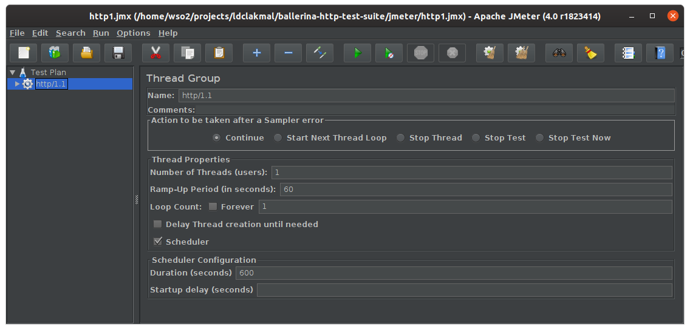

# Ballerina HTTP Test Suite

This is an HTTP test suite which contains guide and all resources to execute performance tests for Ballerina in a local machine or VM.

### Resources
- [JMeter](https://jmeter.apache.org/) scrips
- [Netty](https://netty.io/) backend
- Sample JSON payloads

## Setup

First you have to create 3 instances (VMs/Physical Machines) for JMeter, Ballerina and Netty. Alternatively, you can run all in single instance.

### JMeter

- Download and install [Apache JMeter](https://jmeter.apache.org/).
- Start JMeter of GUI Mode. Refer [Getting Started](https://jmeter.apache.org/usermanual/get-started.html) for more information.
- Import and use the [JMX](./jmeter/) files for HTTP1.1 or HTTP2.0 as required.

### Ballerina

- Download and install [Ballerina](https://ballerina.io/).
- Run the particular [gateway](https://github.com/ballerina-platform/ballerina-performance/tree/master/distribution/scripts/ballerina/bal) *.bal* files by executing following command.

    `$ bal run <file_name.bal>`

### Netty

- Download and install [Docker](https://www.docker.com/).
- Run the Docker image of Netty Echo Backend as required.

    - h1c - `$ docker run -d -p 8688:8688 ldclakmal/netty-echo-backend`
    - h1 - `$ docker run -d -p 8688:8688 -e "SSL=true" ldclakmal/netty-echo-backend`
    - h2c - `$ docker run -d -p 8688:8688 -e "HTTP2=true" ldclakmal/netty-echo-backend`
    - h2 - `$ docker run -d -p 8688:8688 -e "HTTP2=true" -e "SSL=true" ldclakmal/netty-echo-backend`

- Refer the [Docker Hub Image](https://hub.docker.com/repository/docker/ldclakmal/netty-echo-backend) for more information.

## Let's Start

Now, you can start the JMeter with a single request to check whether the request-response path is properly configured.

If not, check the URLs and ports of JMeter, Ballerina Service and Netty Backend and figure out the issue.

If the response is received successfully, start the performance test with the required number of threads, ramp-up period and time.
